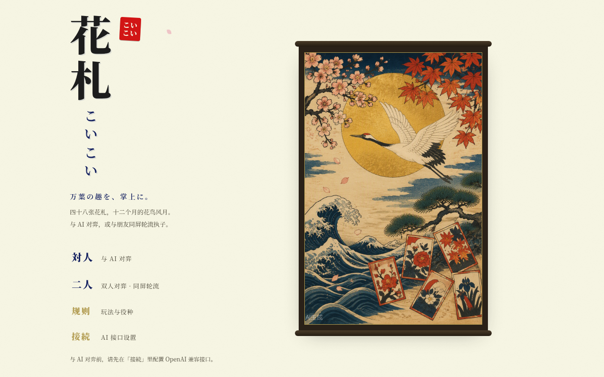
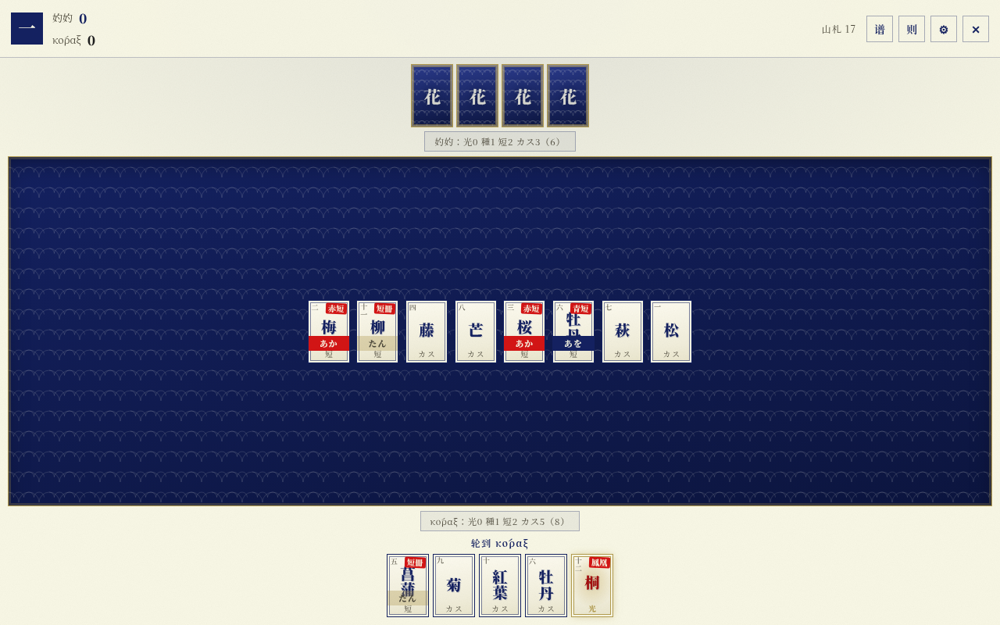

# 花札こいこい

> 万葉の趣を、掌上に。

一个纯静态的日式花札（Hanafuda）「こいこい」对弈小游戏。和纸、靛蓝、朱印、金云——万叶集 × 浮世绘的视觉风格。

**它不内置任何自动打牌逻辑。** AI 席位由一个真实的大语言模型通过 OpenAI 兼容接口驱动——你填谁的 API，对面就坐着谁。也可以两人同屏轮流执子（带交接幕布，谁也偷看不了谁的手牌）。




## 特性

- **完整こいこい规则**：48 张花札、12 种役（五光 / 四光 / 雨四光 / 猪鹿蝶 / 赤短 / 青短 / 月見酒 / 花見酒……）、こいこい 续打与加倍、流局、6 / 12 局制、零和计分
- **LLM 对手**：AI 的每一步都由你配置的大模型实时决策。内置 OpenAI / DeepSeek / Moonshot（Kimi）预设，也可填任何 OpenAI 兼容端点
- **双人同屏**：轮流执子时自动升起幕布，交接给对方
- **零依赖纯静态**：无构建、无框架、无后端。双击 `index.html` 即玩（`file://` 协议可用）
- **规则引擎独立**：`js/engine.js` 是无 DOM 依赖的纯 JS 模块，浏览器 / Node 双环境，方便你接自己的 AI 或做二次开发（见 [docs/API.md](docs/API.md)）

## 快速开始

```bash
# 方式一：直接双击 index.html

# 方式二：起个本地服务（任选其一）
npx serve .
python3 -m http.server 8000
```

打开后：

- **対人｜与 AI 对弈** → 先在「接続｜AI 接口设置」里填 `base_url` / `api_key` / `model`（有「测试连接」按钮），然后开局
- **二人｜双人对弈** → 直接开局，按幕布提示交接设备

## AI 接口说明

- 走 OpenAI 兼容的 `POST {base_url}/chat/completions`；请求体只含 `model / messages / max_tokens`（**不传 `temperature`**——Moonshot 的 kimi-k2.5/k2.6 把它锁死为 1，显式传值会直接 400；遇到只认 `max_completion_tokens` 的平台会自动降级重试）
- `max_tokens` 默认 2048，给推理模型留足思考额度；超时 90 秒
- 配置只保存在你自己浏览器的 `localStorage`，不上传任何地方
- 若浏览器直连被 CORS 拦下：换一个允许浏览器跨域的网关，或自建一层小代理转发
- 游戏会把当前局面（手牌、场牌、双方已拿牌、こいこい 状态、合法动作列表）压缩成文本发给模型，并要求它**只回一个 JSON 动作**；解析失败会自动带着错误信息追问一次

### 常见问题

| 现象 | 原因与对策 |
| --- | --- |
| `HTTP 401：API Key 无效` | key 复制不全，或与站点不对应：Moonshot **国际站**（platform.moonshot.ai）的 key 要把 BASE URL 改成 `https://api.moonshot.ai/v1`，且账户需先充值才能调用；国内站（platform.moonshot.cn）用默认地址即可 |
| `invalid temperature: only 1 is allowed` | 旧版本会触发；现行版本已不传 `temperature`，升级即可 |
| 测试连接成功，但局内「模型返回为空」 | 用的是推理模型（如 deepseek-reasoner），思考把输出额度烧完了。换非推理模型（`deepseek-chat`、`kimi-k2.5` 等），或在 `js/ai.js` 里把 `max_tokens` 再调大 |
| `HTTP 404` | BASE URL 少了 `/v1`，或模型名拼写错误 |

## 项目结构

```
├── index.html        # 入口（首页 / 开局 / 牌桌 三个屏）
├── css/style.css     # 万叶集 × 浮世绘视觉系统
├── js/
│   ├── engine.js     # 纯规则引擎（浏览器 / Node 双环境，无外部依赖）
│   ├── ai.js         # OpenAI 兼容 LLM 客户端：prompt 构建、JSON 解析校验、重试
│   └── ui.js         # 渲染、交互、双人幕布、AI 驱动循环
├── assets/           # 主视觉（AI 生成）
├── test/smoke.js     # 引擎冒烟测试
└── docs/API.md       # 二次开发接口文档
```

## 测试

```bash
node test/smoke.js
```

用随机合法动作打完整场对局，校验状态机收敛与零和计分。

## 许可

- 代码：MIT License（见 [LICENSE](LICENSE)）
- 花札游戏规则本身属公共领域
- `assets/hero.png` 为 AI 生成素材，随项目以 MIT 分发
- 本项目引擎移植自作者的橘岛（OrangeIsland）花札插件
